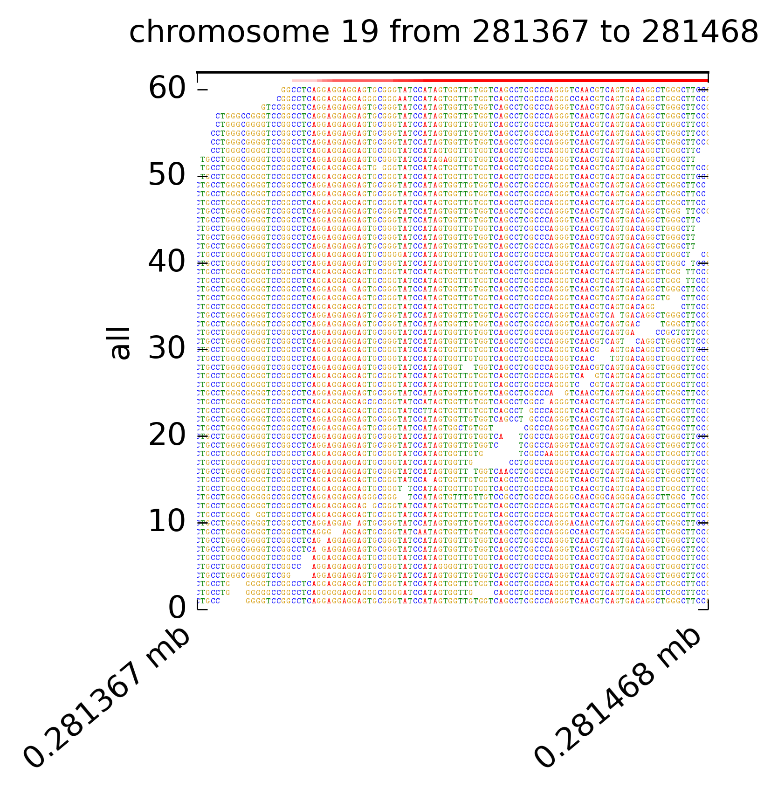
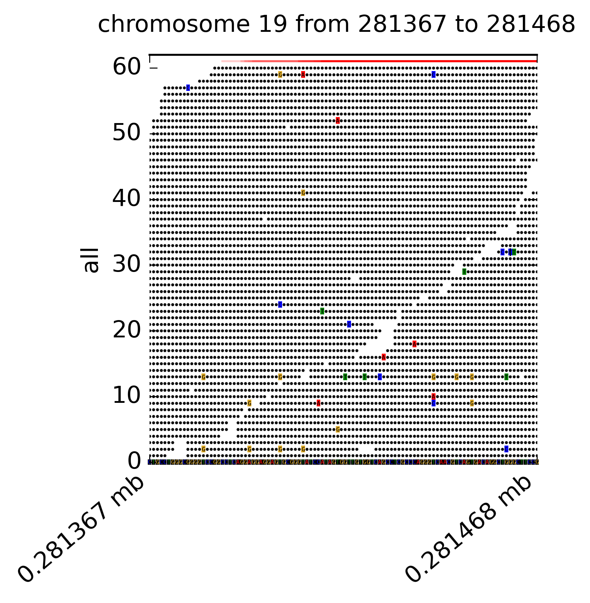
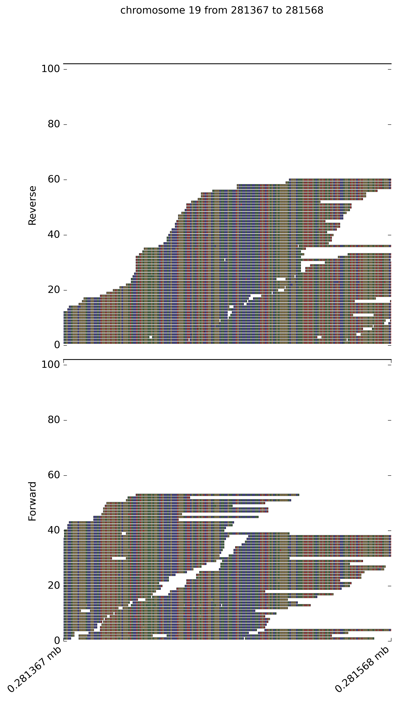

# DrukBam
`DrukBam` is a straight forward program for plotting alignment files without leaving the commandline. It can be used with or without a reference fasta file and allows fast plotting multiple variants or regions of interest.

## reference free
<center></center>

## including a reference
<center></center>

## split by read direction
<center></center>


## bigger span
<center></center>


# Usage
<details>
  <summary>DrukBam vcf</summary>

  ```
  usage: DrukBam vcf [-h] -b BAM -v VCF [-p PADDING] [--highlight]
                     [--threads THREADS] [--maxcoverage MAXCOVERAGE]
                     [--direction] [--schematic] [--style STYLE] [--fasta FASTA]
                     [--outputdir OUTPUTDIR] [-i ID] [--chunksize CHUNKSIZE]
                     [--outfmt OUTFMT] [--outlineoff]

  optional arguments:
    -h, --help            show this help message and exit

  required arguments:
    -b BAM, --bam BAM     Pos. sorted and indexed bam file
    -v VCF, --vcf VCF     vcf file with variants of interest
    -p PADDING, --padding PADDING
                          number of nt around the variant
    --highlight           highlight the position of interest

  optional arguments:
    --threads THREADS     number of cpu's to run in paralell, ROI <1000 will
                          always use 1 core
    --maxcoverage MAXCOVERAGE
                          max cov to plot
    --direction           split reads by forward and reverse
    --schematic           plot no nucleotide, recommended for ROI>1000
    --style STYLE         different style options for the plot, provide .ini
                          file
    --fasta FASTA         fasta file for reference related plotting
    --outputdir OUTPUTDIR
                          directory for output
    -i ID, --id ID        output filename
    --chunksize CHUNKSIZE
                          max size of visualized area, can be increases but will
                          sow down calculation
    --outfmt OUTFMT       format of plot, choose between pdf,svg,png
    --outlineoff          plotting of read outline

```
</details>


<details>
  <summary>DrukBam region</summary>

  ```
  usage: DrukBam region [-h] -b BAM -c CHROMOSOME -s START -e END
                      [--threads THREADS] [--maxcoverage MAXCOVERAGE]
                      [--direction] [--schematic] [--style STYLE]
                      [--fasta FASTA] [--outputdir OUTPUTDIR] [-i ID]
                      [--chunksize CHUNKSIZE] [--outfmt OUTFMT] [--outlineoff]

optional arguments:
  -h, --help            show this help message and exit

required arguments:
  -b BAM, --bam BAM     Pos. sorted and indexed bam file
  -c CHROMOSOME, --chromosome CHROMOSOME
                        name of chromosome/contig
  -s START, --start START
                        start of region of interest
  -e END, --end END     end of the region of interest

optional arguments:
  --threads THREADS     number of cpu's to run in paralell, ROI <1000 will
                        always use 1 core
  --maxcoverage MAXCOVERAGE
                        max cov to plot
  --direction           split reads by forward and reverse
  --schematic           plot no nucleotide, recommended for ROI>1000
  --style STYLE         different style options for the plot, provide .ini
                        file
  --fasta FASTA         fasta file for reference related plotting
  --outputdir OUTPUTDIR
                        directory for output
  -i ID, --id ID        output filename
  --chunksize CHUNKSIZE
                        max size of visualized area, can be increases but will
                        sow down calculation
  --outfmt OUTFMT       format of plot, choose between pdf,svg,png
  --outlineoff          plotting of read outline


```
</details>


## Installing

# requiremnts

* pysam
* pandas
* matplotlib
* tqdm

install via pip:
```
pip install pysam pandas matplotlib tqdm

```

or via conda:
```
conda install -c conda-forge -c anaconda -c bioconda  matplotlib pandas tqdm pysam pip

```

If you create an virt. enviroment for DrukBam make sure to install pip in this env, otherwise you global pip will be used and DrukBam will be installed in the base env


# installation 

currently `DrukBam` is available only via pypi:

```
pip install drukbam

```
A conda env and a docker image will follow


## Usage Examples:

The following command will create an image of that region:
```
DrukBam region  -s 281367 -e 281468   -c 19 -b test_data/test_small.bam  --outfmt png  -i example_out --maxcoverage 60 --outlineoff --fasta test_data/chr19_first500k.fasta
```

The arguments used above are:

`-s` start of ROI

`-e` end of ROI

`-c` chromosome of ROI


`-b` alignment file, sorted and index

`--outfmt` format of plot

`-i` ID which is used for naming the plot

`--maxcoverage` yaxis max of plot

`--outlineoff` dont draw outlines around every read

`--fasta` location of ref. fasta


The following command will plot all positions in a vcf file:
```
DrukBam vcf -b test_data/test_small.bam  -v example.vcf --padding 100  -i example_vcf --maxcoverage 60  --fasta test_data/chr19_first500k.fasta --threads 12
```

The arguments used above are:


`-b` alignment file, sorted and index

`-v` vcf file 

`-i` ID which is used for naming the plot

`--maxcoverage` yaxis max of plot

`--fasta` location of ref. fasta

`--threads` number of cpu's to use,

