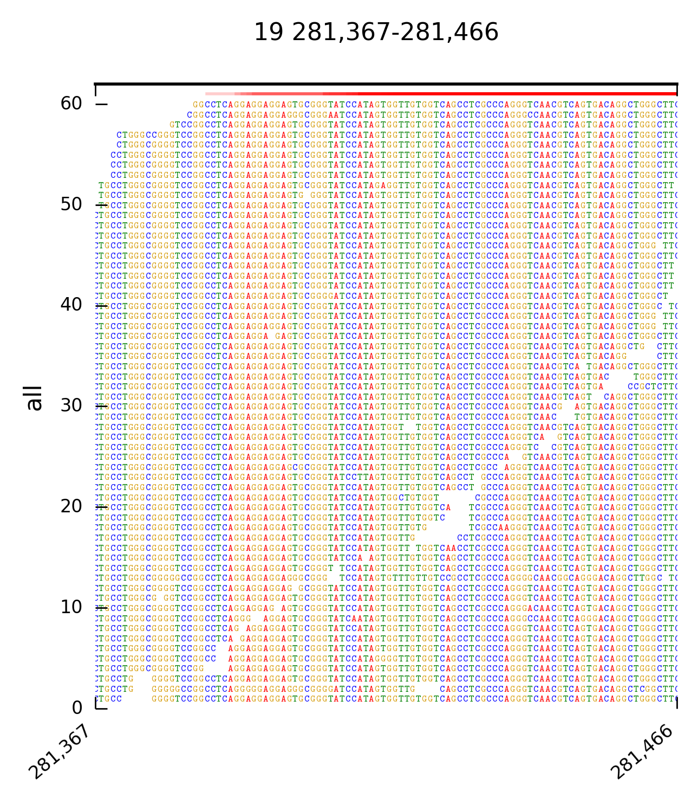
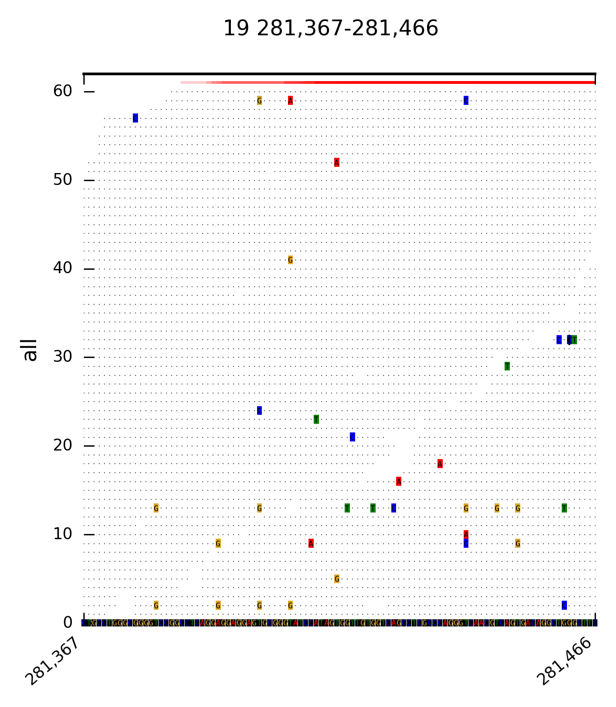
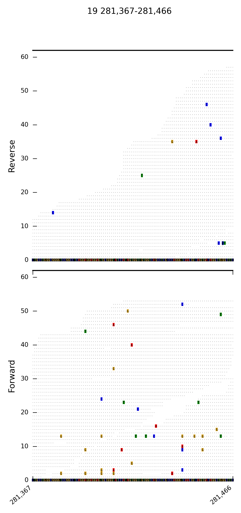
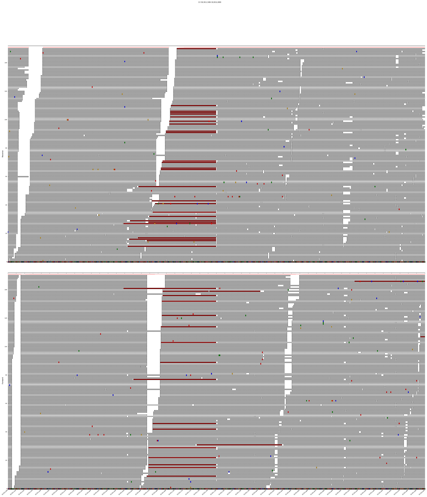

# DrukBam
### `DrukBam` is a  program for plotting alignment files (.bam) for all comandline aficionados.

DrukBam  can be used with or without a reference fasta file and allows fast plotting multiple variants or regions of interest. Please provide feedback like bugs or options you might miss, I wrote this programm because I did not found a convicning tool to provide fast plotting of alignemnts withput using a GUI like in IGV or Tablet.

## reference free
<center></center>

## including a reference
<center></center>

## split reads by strand
<center></center>


## bigger span
<center></center>


## changing plt style to dark or bmh
<center></center>

<center></center>


## highlight soft/hard clipped reads by threshold --> visualize insertion points
<center></center>


# Installing

## requirements

* pysam
* pandas
* matplotlib
* tqdm


## installation

`DrukBam` is available  via pypi:

```
pip install drukbam==1.1.4

```

docker image

```
docker pull stephanholgerdrukewitz/drukbam:1.1.4

```


docker usage


```

docker  run -it --rm -v $PWD:/data drukbam:1.1.4 DrukBam region  -s 281367 -e 281468   -c 19 -b /data/test_data/test_small.bam  --outfmt png  -i example_out_small --maxcoverage 60 --outlineoff

```

****
:heavy_exclamation_mark: :heavy_exclamation_mark: **versions <1.1.4 are deprecated and should not be used anymore** :heavy_exclamation_mark: :heavy_exclamation_mark:
****
# Usage
<details>
  <summary>DrukBam vcf</summary>

  ```
  usage: DrukBam vcf [-h] -b BAM -v VCF [-p PADDING] [--highlight]
                     [--threads THREADS] [--maxcoverage MAXCOVERAGE]
                     [--direction] [--schematic] [--style STYLE] [--fasta FASTA]
                     [--outputdir OUTPUTDIR] [-i ID] [--chunksize CHUNKSIZE]
                     [--outfmt OUTFMT] [--outlineoff]

  optional arguments:
    -h, --help            show this help message and exit

  required arguments:
    -b BAM, --bam BAM     Pos. sorted and indexed bam file
    -v VCF, --vcf VCF     vcf file with variants of interest
    -p PADDING, --padding PADDING
                          number of nt around the variant
    --highlight           highlight the position of interest

  optional arguments:
    --threads THREADS     number of cpu's to run in paralell, ROI <1000 will
                          always use 1 core
    --maxcoverage MAXCOVERAGE
                          max cov to plot
    --direction           split reads by forward and reverse
    --schematic           plot no nucleotide, recommended for ROI>1000
    --style STYLE         different style options for the plot, provide .ini
                          file
    --fasta FASTA         fasta file for reference related plotting
    --outputdir OUTPUTDIR
                          directory for output
    -i ID, --id ID        output filename
    --chunksize CHUNKSIZE
                          max size of visualized area, can be increases but will
                          sow down calculation
    --outfmt OUTFMT       format of plot, choose between pdf,svg,png
    --outlineoff          plotting of read outline

```
</details>


<details>
  <summary>DrukBam region</summary>

  ```
  usage: DrukBam region [-h] -b BAM -c CHROMOSOME -s START -e END
                      [--threads THREADS] [--maxcoverage MAXCOVERAGE]
                      [--direction] [--schematic] [--style STYLE]
                      [--fasta FASTA] [--outputdir OUTPUTDIR] [-i ID]
                      [--chunksize CHUNKSIZE] [--outfmt OUTFMT] [--outlineoff]

optional arguments:
  -h, --help            show this help message and exit

required arguments:
  -b BAM, --bam BAM     Pos. sorted and indexed bam file
  -c CHROMOSOME, --chromosome CHROMOSOME
                        name of chromosome/contig
  -s START, --start START
                        start of region of interest
  -e END, --end END     end of the region of interest

optional arguments:
  --threads THREADS     number of cpu's to run in paralell, ROI <1000 will
                        always use 1 core
  --maxcoverage MAXCOVERAGE
                        max cov to plot
  --direction           split reads by forward and reverse
  --schematic           plot no nucleotide, recommended for ROI>1000
  --style STYLE         different style options for the plot, provide .ini
                        file
  --fasta FASTA         fasta file for reference related plotting
  --outputdir OUTPUTDIR
                        directory for output
  -i ID, --id ID        output filename
  --chunksize CHUNKSIZE
                        max size of visualized area, can be increases but will
                        sow down calculation
  --outfmt OUTFMT       format of plot, choose between pdf,svg,png
  --outlineoff          plotting of read outline


```
</details>


## Usage Examples:

The following command will create an image of that region:
```
DrukBam region  -s 281367 -e 281468   -c 19 -b test_data/test_small.bam  --outfmt png  -i example_out --maxcoverage 60 --outlineoff --fasta test_data/chr19_first500k.fasta
```

The arguments used above are:

`-s` start of ROI

`-e` end of ROI

`-c` chromosome of ROI


`-b` alignment file, sorted and indexed

`--outfmt` format of plot

`-i` ID which is used for naming the plot

`--maxcoverage` yaxis max of plot

`--outlineoff` dont draw outlines around every read

`--fasta` location of ref. fasta


The following command will plot all positions in a vcf file:
```
DrukBam vcf -b test_data/test_small.bam  -v example.vcf --padding 100  -i example_vcf --maxcoverage 60  --fasta test_data/chr19_first500k.fasta --threads 12
```

The arguments used above are:


`-b` alignment file, sorted and indexed

`-v` vcf file

`-i` ID which is used for naming the plot

`--maxcoverage` yaxis max of plot

`--fasta` location of ref. fasta

`--threads` number of cpu's to use,

## Style changes:

* color and style can be changed using the --style option and providing a [style.ini](https://github.com/StephanHolgerD/DrukBam/blob/master/style.ini) file
* official matplotlib colors are allowed  [color list](https://matplotlib.org/2.0.2/examples/color/named_colors.html)
* pltstyle can be changed  [style list](https://matplotlib.org/stable/gallery/style_sheets/style_sheets_reference.html)

---


```
